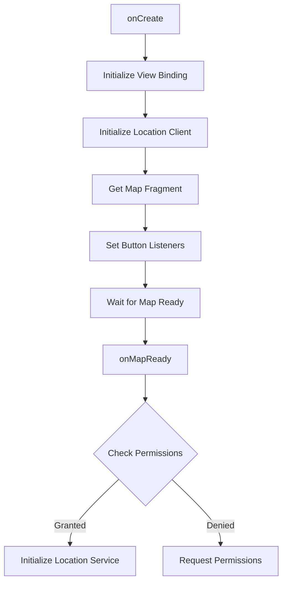
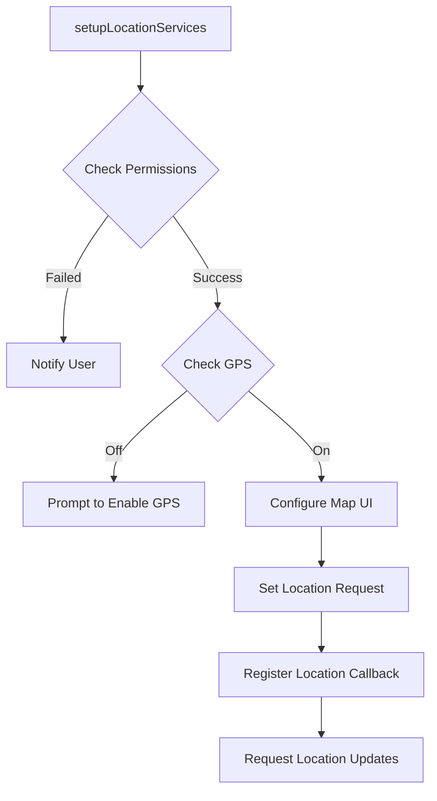
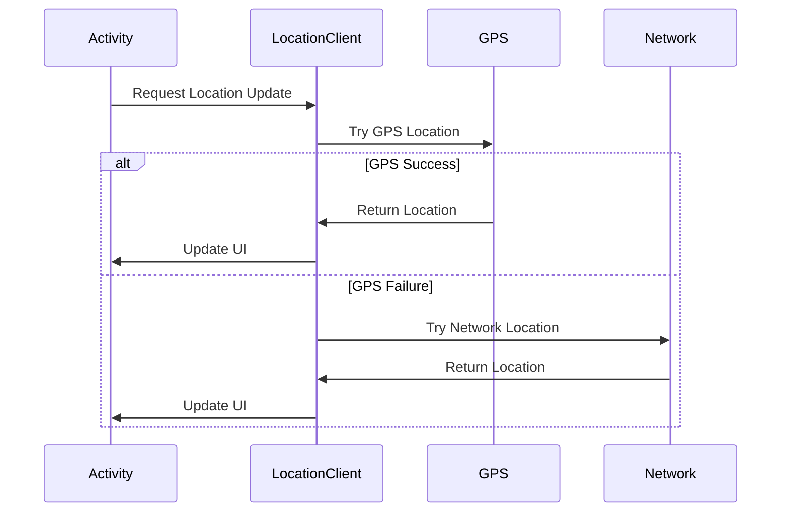
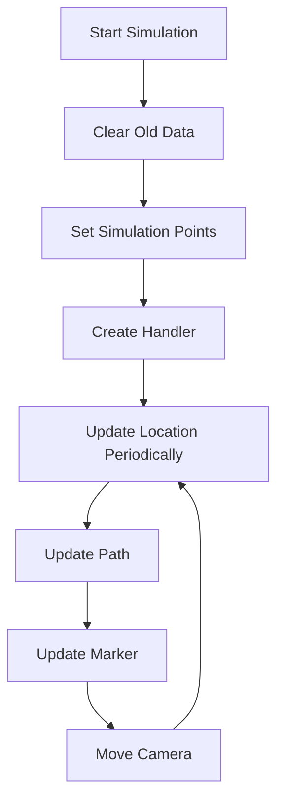
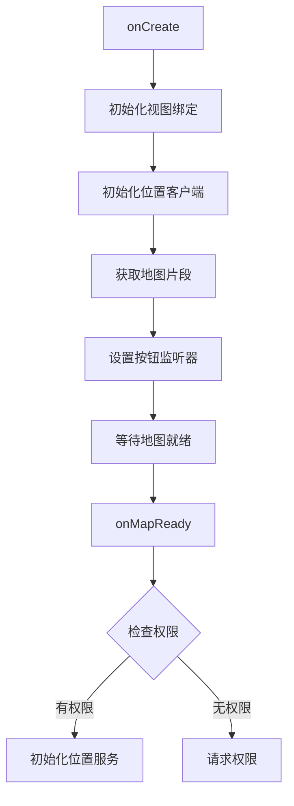
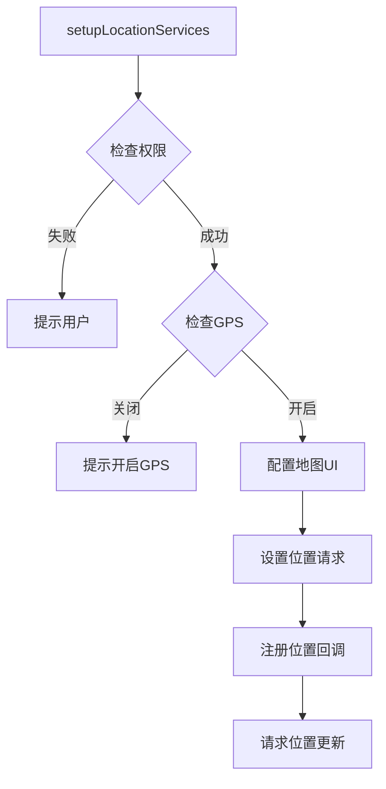
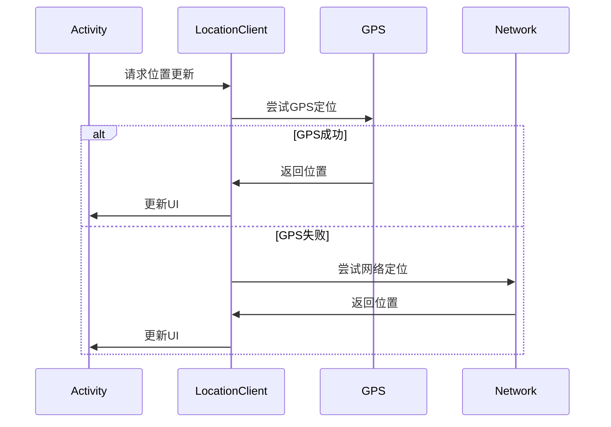
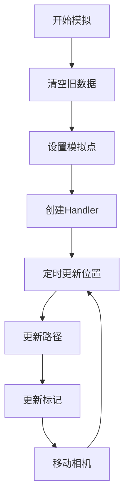

# MapsActivity Documentation | MapsActivity 技术文档

<div align="right">
  <button onclick="toggleLanguage()">Switch Language | 切换语言</button>
</div>

<div id="en" style="display: none;">
# MapsActivity Technical Documentation

## Table of Contents
1. [Overview](#overview)
2. [Core Components](#core-components)
3. [Main Functionality](#main-functionality)
4. [Implementation Details](#implementation-details)
5. [Location Services](#location-services)
6. [Route Simulation](#route-simulation)
7. [Error Handling](#error-handling)
8. [Logging System](#logging-system)
9. [Performance Optimization](#performance-optimization)
10. [User Interface](#user-interface)

## Overview
MapsActivity is an Android activity based on Google Maps SDK, providing real-time location tracking, path drawing, and location simulation features. It uses ViewBinding for view binding and FusedLocationProviderClient for location service management.

## Core Components

### Class Properties
```kotlin
private val pathPoints = mutableListOf<LatLng>()  // Store path points
private var polyline: Polyline? = null            // Path line object
private lateinit var mMap: GoogleMap             // Map object
private lateinit var binding: ActivityMapsBinding // View binding
private lateinit var fusedLocationClient: FusedLocationProviderClient // Location service client
private lateinit var locationCallback: LocationCallback // Location callback
private var currentLocationMarker: Marker? = null // Current location marker
private var isTrackingEnabled = true             // Tracking status
```

## Main Functionality

### Initialization Flow


### Location Service Initialization


## Implementation Details

### Location Tracking
```kotlin
val locationRequest = LocationRequest.Builder(
    Priority.PRIORITY_HIGH_ACCURACY, 2000L
)
    .setMinUpdateDistanceMeters(1f)
    .setGranularity(Granularity.GRANULARITY_FINE)
    .setWaitForAccurateLocation(true)
    .build()
```
- Update Interval: 2 seconds
- Minimum Distance: 1 meter
- Accuracy: High
- Wait for Accurate Location

### Path Drawing
```kotlin
private fun updatePolyline() {
    polyline?.remove()
    if (pathPoints.size > 1) {
        polyline = mMap.addPolyline(
            PolylineOptions()
                .addAll(pathPoints)
                .color(android.graphics.Color.BLUE)
                .width(8f)
        )
    }
}
```

### Location Marker Update
```kotlin
private fun updateLocationMarker(latLng: LatLng) {
    if (currentLocationMarker == null) {
        currentLocationMarker = mMap.addMarker(
            MarkerOptions()
                .position(latLng)
                .title("Current Location")
                .icon(BitmapDescriptorFactory.defaultMarker(BitmapDescriptorFactory.HUE_AZURE))
        )
    } else {
        currentLocationMarker?.position = latLng
    }
}
```

## Location Services

### Multi-location Strategy


### Location Update Process
1. Try to get last known location
2. If failed, start high-accuracy GPS location
3. If GPS location fails, fallback to network location
4. Continue updating location information

## Route Simulation

### Simulation Points
```kotlin
val simulatedPoints = listOf(
    LatLng(39.916345, 116.397155), // Forbidden City
    LatLng(39.908722, 116.397499), // Tiananmen Square
    LatLng(39.900269, 116.397872), // Qianmen
    LatLng(39.893, 116.397)        // Near Temple of Heaven
)
```

### Simulation Animation Flow


## Error Handling

### Permission Handling
```kotlin
private fun hasLocationPermissions(): Boolean {
    val fine = ActivityCompat.checkSelfPermission(this, Manifest.permission.ACCESS_FINE_LOCATION)
    val coarse = ActivityCompat.checkSelfPermission(this, Manifest.permission.ACCESS_COARSE_LOCATION)
    return fine == PackageManager.PERMISSION_GRANTED && 
           coarse == PackageManager.PERMISSION_GRANTED
}
```

### Exception Handling
- SecurityException: Permission-related exceptions
- Location service not enabled
- Location acquisition failure
- Network location failure

## Logging System

### Log Tags
Use "MAP" tag for key information:
- Initialization status
- Permission status
- Location updates
- Error messages

### Log Levels
- D: Debug information
- E: Error information
- I: Important status changes

## Performance Optimization

### Location Update Optimization
- Minimum update distance limit
- Smart power management
- Location accuracy balance

### Memory Management
- Timely cleanup of location update listeners
- Appropriate path point storage strategy

## User Interface

### Map Controls
- Location button
- Zoom controls
- Compass
- Manual refresh button
- Route simulation button

### Interaction Feedback
- Toast message notifications
- Location update animations
- Path drawing animations
</div>

<div id="zh" style="display: block;">
# MapsActivity 技术文档

## 目录
1. [概述](#概述)
2. [核心组件](#核心组件)
3. [主要功能](#主要功能)
4. [实现细节](#实现细节)
5. [位置服务](#位置服务)
6. [路线模拟](#路线模拟)
7. [错误处理](#错误处理)
8. [日志系统](#日志系统)
9. [性能优化](#性能优化)
10. [用户界面](#用户界面)

## 概述
MapsActivity 是一个基于 Google Maps SDK 的 Android 活动，提供实时位置追踪、路径绘制和位置模拟功能。该活动使用 ViewBinding 进行视图绑定，使用 FusedLocationProviderClient 进行位置服务管理。

## 核心组件

### 类属性
```kotlin
private val pathPoints = mutableListOf<LatLng>()  // 存储路径点
private var polyline: Polyline? = null            // 路径线对象
private lateinit var mMap: GoogleMap             // 地图对象
private lateinit var binding: ActivityMapsBinding // 视图绑定
private lateinit var fusedLocationClient: FusedLocationProviderClient // 位置服务客户端
private lateinit var locationCallback: LocationCallback // 位置回调
private var currentLocationMarker: Marker? = null // 当前位置标记
private var isTrackingEnabled = true             // 跟踪状态
```

## 主要功能

### 初始化流程


### 位置服务初始化


## 实现细节

### 位置追踪
```kotlin
val locationRequest = LocationRequest.Builder(
    Priority.PRIORITY_HIGH_ACCURACY, 2000L
)
    .setMinUpdateDistanceMeters(1f)
    .setGranularity(Granularity.GRANULARITY_FINE)
    .setWaitForAccurateLocation(true)
    .build()
```
- 更新间隔：2秒
- 最小距离：1米
- 精度：高精度
- 等待准确位置

### 路径绘制
```kotlin
private fun updatePolyline() {
    polyline?.remove()
    if (pathPoints.size > 1) {
        polyline = mMap.addPolyline(
            PolylineOptions()
                .addAll(pathPoints)
                .color(android.graphics.Color.BLUE)
                .width(8f)
        )
    }
}
```

### 位置标记更新
```kotlin
private fun updateLocationMarker(latLng: LatLng) {
    if (currentLocationMarker == null) {
        currentLocationMarker = mMap.addMarker(
            MarkerOptions()
                .position(latLng)
                .title("当前位置")
                .icon(BitmapDescriptorFactory.defaultMarker(BitmapDescriptorFactory.HUE_AZURE))
        )
    } else {
        currentLocationMarker?.position = latLng
    }
}
```

## 位置服务

### 多重定位策略


### 位置更新流程
1. 首先尝试获取最后已知位置
2. 如果失败，启动高精度GPS定位
3. 如果GPS定位失败，降级到网络定位
4. 持续更新位置信息

## 路线模拟

### 模拟点设置
```kotlin
val simulatedPoints = listOf(
    LatLng(39.916345, 116.397155), // 故宫
    LatLng(39.908722, 116.397499), // 天安门
    LatLng(39.900269, 116.397872), // 前门
    LatLng(39.893, 116.397)        // 天坛边
)
```

### 模拟动画流程


## 错误处理

### 权限处理
```kotlin
private fun hasLocationPermissions(): Boolean {
    val fine = ActivityCompat.checkSelfPermission(this, Manifest.permission.ACCESS_FINE_LOCATION)
    val coarse = ActivityCompat.checkSelfPermission(this, Manifest.permission.ACCESS_COARSE_LOCATION)
    return fine == PackageManager.PERMISSION_GRANTED && 
           coarse == PackageManager.PERMISSION_GRANTED
}
```

### 异常处理
- SecurityException：权限相关异常
- 位置服务未开启
- 位置获取失败
- 网络定位失败

## 日志系统

### 日志标签
使用 "MAP" 标签记录关键信息：
- 初始化状态
- 权限状态
- 位置更新
- 错误信息

### 日志级别
- D：调试信息
- E：错误信息
- I：重要状态变化

## 性能优化

### 位置更新优化
- 最小更新距离限制
- 智能电源管理
- 位置精度平衡

### 内存管理
- 及时清理位置更新监听
- 适当的路径点存储策略

## 用户界面

### 地图控件
- 位置按钮
- 缩放控制
- 指南针
- 手动刷新按钮
- 模拟路线按钮

### 交互反馈
- Toast 消息提示
- 位置更新动画
- 路径绘制动画
</div>

<script>
function toggleLanguage() {
    const enDiv = document.getElementById('en');
    const zhDiv = document.getElementById('zh');
    if (enDiv.style.display === 'none') {
        enDiv.style.display = 'block';
        zhDiv.style.display = 'none';
    } else {
        enDiv.style.display = 'none';
        zhDiv.style.display = 'block';
    }
}
</script> 