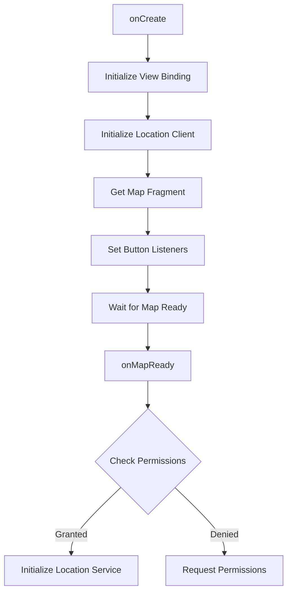
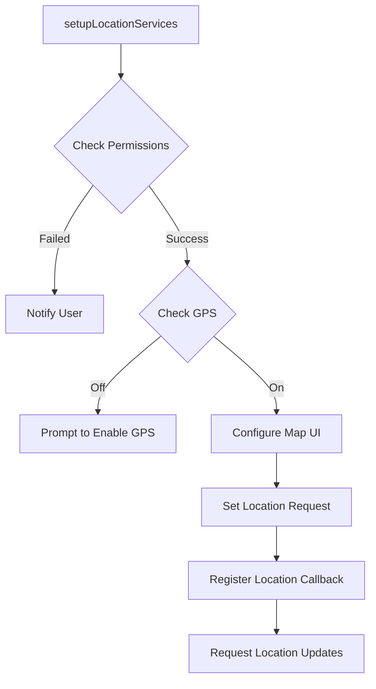
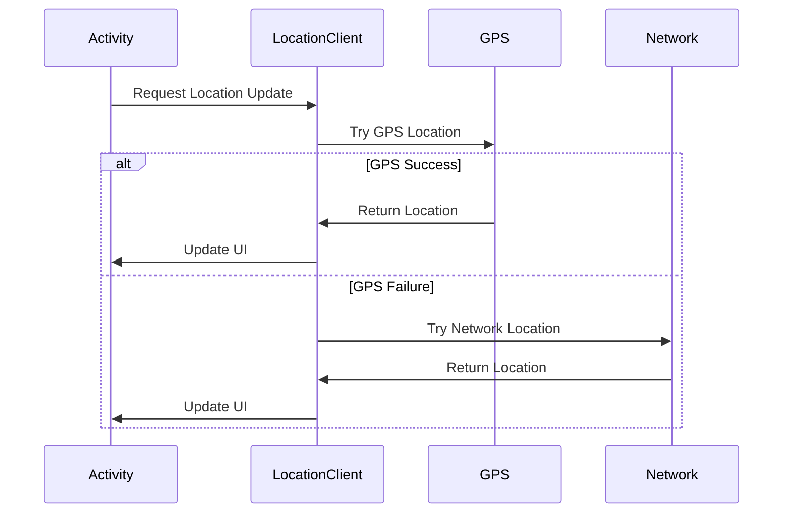
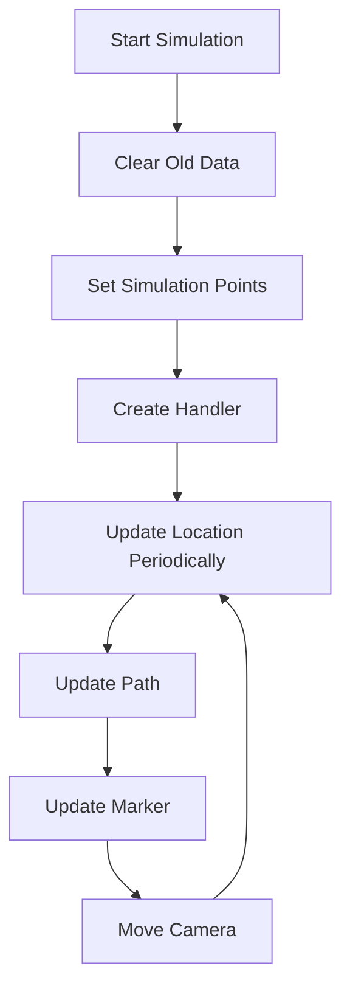

# MapsActivity Technical Documentation

[切换到中文版](MapsActivity_Documentation_CN.md)

## Table of Contents
1. [Overview](#overview)
2. [Core Components](#core-components)
3. [Main Functionality](#main-functionality)
4. [Implementation Details](#implementation-details)
5. [Location Services](#location-services)
6. [Route Simulation](#route-simulation)
7. [Error Handling](#error-handling)
8. [Logging System](#logging-system)
9. [Performance Optimization](#performance-optimization)
10. [User Interface](#user-interface)

## Overview
MapsActivity is an Android activity based on Google Maps SDK, providing real-time location tracking, path drawing, and location simulation features. It uses ViewBinding for view binding and FusedLocationProviderClient for location service management.

## Core Components

### Class Properties
```kotlin
private val pathPoints = mutableListOf<LatLng>()  // Store path points
private var polyline: Polyline? = null            // Path line object
private lateinit var mMap: GoogleMap             // Map object
private lateinit var binding: ActivityMapsBinding // View binding
private lateinit var fusedLocationClient: FusedLocationProviderClient // Location service client
private lateinit var locationCallback: LocationCallback // Location callback
private var currentLocationMarker: Marker? = null // Current location marker
private var isTrackingEnabled = true             // Tracking status
```

## Main Functionality

### Initialization Flow


### Location Service Initialization


## Implementation Details

### Location Tracking
```kotlin
val locationRequest = LocationRequest.Builder(
    Priority.PRIORITY_HIGH_ACCURACY, 2000L
)
    .setMinUpdateDistanceMeters(1f)
    .setGranularity(Granularity.GRANULARITY_FINE)
    .setWaitForAccurateLocation(true)
    .build()
```
- Update Interval: 2 seconds
- Minimum Distance: 1 meter
- Accuracy: High
- Wait for Accurate Location

### Path Drawing
```kotlin
private fun updatePolyline() {
    polyline?.remove()
    if (pathPoints.size > 1) {
        polyline = mMap.addPolyline(
            PolylineOptions()
                .addAll(pathPoints)
                .color(android.graphics.Color.BLUE)
                .width(8f)
        )
    }
}
```

### Location Marker Update
```kotlin
private fun updateLocationMarker(latLng: LatLng) {
    if (currentLocationMarker == null) {
        currentLocationMarker = mMap.addMarker(
            MarkerOptions()
                .position(latLng)
                .title("Current Location")
                .icon(BitmapDescriptorFactory.defaultMarker(BitmapDescriptorFactory.HUE_AZURE))
        )
    } else {
        currentLocationMarker?.position = latLng
    }
}
```

## Location Services

### Multi-location Strategy


### Location Update Process
1. Try to get last known location
2. If failed, start high-accuracy GPS location
3. If GPS location fails, fallback to network location
4. Continue updating location information

## Route Simulation

### Simulation Points
```kotlin
val simulatedPoints = listOf(
    LatLng(39.916345, 116.397155), // Forbidden City
    LatLng(39.908722, 116.397499), // Tiananmen Square
    LatLng(39.900269, 116.397872), // Qianmen
    LatLng(39.893, 116.397)        // Near Temple of Heaven
)
```

### Simulation Animation Flow


## Error Handling

### Permission Handling
```kotlin
private fun hasLocationPermissions(): Boolean {
    val fine = ActivityCompat.checkSelfPermission(this, Manifest.permission.ACCESS_FINE_LOCATION)
    val coarse = ActivityCompat.checkSelfPermission(this, Manifest.permission.ACCESS_COARSE_LOCATION)
    return fine == PackageManager.PERMISSION_GRANTED && 
           coarse == PackageManager.PERMISSION_GRANTED
}
```

### Exception Handling
- SecurityException: Permission-related exceptions
- Location service not enabled
- Location acquisition failure
- Network location failure

## Logging System

### Log Tags
Use "MAP" tag for key information:
- Initialization status
- Permission status
- Location updates
- Error messages

### Log Levels
- D: Debug information
- E: Error information
- I: Important status changes

## Performance Optimization

### Location Update Optimization
- Minimum update distance limit
- Smart power management
- Location accuracy balance

### Memory Management
- Timely cleanup of location update listeners
- Appropriate path point storage strategy

## User Interface

### Map Controls
- Location button
- Zoom controls
- Compass
- Manual refresh button
- Route simulation button

### Interaction Feedback
- Toast message notifications
- Location update animations
- Path drawing animations 